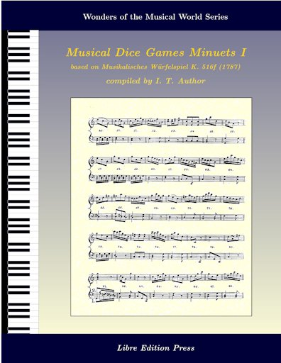

## mdgBookSVG1v1

[... **Under construction**...]

**Here's an opportunity to author a Book!!!**

This folder contains materials that allow the user to author a book containing a collection of [Musical Dice Game (MDG)](https://en.wikipedia.org/wiki/Musikalisches_W%C3%BCrfelspiel) minuets, generated based on the rules given in  [Musikalisches Würfelspiel, K.516f (Mozart, Wolfgang Amadeus)](http://imslp.org/wiki/Musikalisches_W%C3%BCrfelspiel,_K.516f_(Mozart,_Wolfgang_Amadeus)). 

A sample front cover of the book is given below: 

## Acknowledgements
My sincerest gratitude to Chris Walshaw et al. for the [ABC music notation](http://www.abcnotation.com);  Jean-Francois Moine for [abcm2ps](http://moinejf.free.fr/) and [abcmplugin](http://moinejf.free.fr/), and the accompanying examples, templates, and pointers for the appropriate use of these resources;  Guido Gonzato for the [ABC Plus Project](http://abcplus.sourceforge.net/) and the [abcmidi resources](http://abcplus.sourceforge.net/#abcMIDI) available there, more especially for the ABC resource book *Making Music with ABC 2*; James R. Allwright and Seymour Shlien for [abcmidi](http://abc.sourceforge.net/abcMIDI) source and binaries; and [Artifex, Inc.](https://artifex.com) for Ghostscript (includes the `ps2pdf` converter).  Special thanks also to the [International Music Score Library Project (IMSLP)](http://imslp.org/) for making available the score for *Musikalisches Würfelspiel, K.516f*.  Ditto to Machtelt Garrels for the book [Bash Guide for Beginners](http://tldp.org/LDP/Bash-Beginners-Guide/html/Bash-Beginners-Guide.html), Vivek Gite for the book [Linux Script Shell Tutorial](http://www.freeos.com/guides/lsst/), and Steve Parker for the [Unix/Linux Shell Cheatsheet](http://steve-parker.org/sh/cheatsheet.pdf).  Many more (later) ... 

## License
 <b>mdg2abc</b> by <a xmlns:cc="http://creativecommons.org/ns#" href="https://github.com/justineuro/mdgBookSVGv1" property="cc:attributionName" rel="cc:attributionURL">Justine Leon A. Uro</a> is licensed under a <a rel="license" href="http://creativecommons.org/licenses/by/4.0/">Creative Commons Attribution 4.0 International License</a>. Based on a work at <a xmlns:dct="http://purl.org/dc/terms/" href="https://github.com/justineuro/mdgBookSVGv1" rel="dct:source">https://github.com/justineuro/mdgBookSVGv1</a>